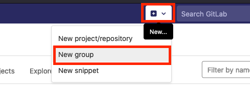
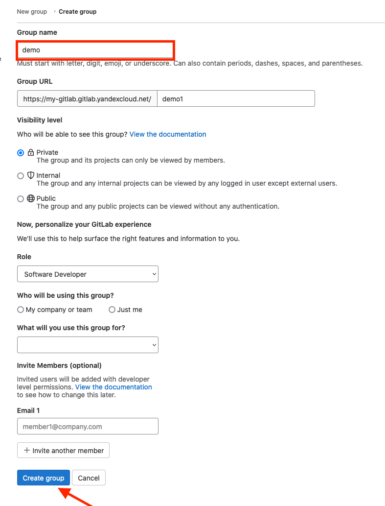
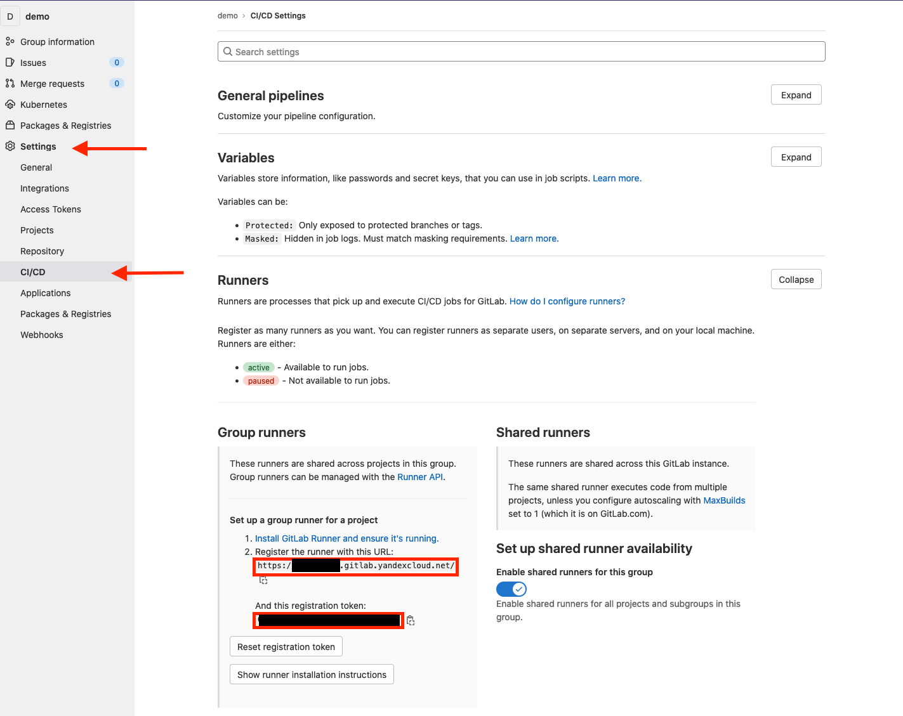

# Creating an infrastructure bench

## Creating a Kubernetes cluster

**In this example, all resources are created in the default folder.**

Make sure to install
[yc](https://cloudil.co.il/docs/cli/operations/install-cli.html),
[kubectl](https://kubernetes.io/ru/docs/tasks/tools/install-kubectl/),
 and [helm](https://helm.sh/docs/intro/install/).

For `yc`, you need to [create a profile](https://cloudil.co.il/docs/cli/quickstart.html#initialize)
and log in.

* Create a service account for your future cluster.

```bash
yc iam service-account create mothership-sa
```

* Grant the service account rights for the default folder.

> From this point on, if the folder name is different from `default`,
> you should change it.
> The same refers to network and subnet names.

```bash
yc resource-manager folder add-access-binding \
  --name=default \
  --service-account-name=mothership-sa \
  --role=editor
```

* Create a public zonal cluster of the most recent version named `mothership`
   in the `il1-a` availability zone.

```bash
yc managed-kubernetes cluster create \
  --name=mothership \
  --public-ip \
  --network-name=default \
  --service-account-name=mothership-sa \
  --node-service-account-name=mothership-sa \
  --release-channel=rapid \
  --zone=il1-a \
  --folder-name default
```

* Create a node group for the cluster.
   Initially, the group should contain a single preemptible host c4m8.
   It should be automatically scaled to 4 clusters like this.

> Make sure to substitute the `username` and `ssh pubkey` values.

```bash
yc managed-kubernetes node-group create \
  --name=mothership-preempt-b \
  --cluster-name=mothership \
  --cores=4 \
  --memory=8G \
  --preemptible \
  --auto-scale=initial=1,min=1,max=4 \
  --network-interface=subnets=default-il1-a,ipv4-address=nat \
  --folder-name default \
  --metadata="ssh-keys=username:ssh-ed25519 AAAA.... username"
```

* Get kubeconfig with authorization

```
yc managed-kubernetes cluster get-credentials --name=mothership --external
```

* Test the cluster, such as:

```
kubectl get nodes
```

## Installing Gitlab

You can use your existing GitLab installation or install one using [official guide](https://docs.gitlab.com/ee/install/cloud_native/)

## Installing Gitlab Runner

* Create a `demo` group in your Gitlab instance.




* Select `CI/CD` -> `Runners` in the settings of the new group.
   You'll need the `URL` and `Registration Token` parameters.



* Next, use Helm to install the runner in our Kubernetes cluster
   by replacing the placeholders with the values from the Gitlab UI.

```bash
helm repo add gitlab https://charts.gitlab.io
helm install gitlab-runner gitlab/gitlab-runner
  --set gitlabUrl=<Gitlab instance URL> \
  --set runnerRegistrationToken=<Gitlab Registration Token> \
  --set rbac.create=true \
  --namespace gitlab \
  --create-namespace
```

## Creating a Container Registry

* Create a registry.

```bash
yc container registry create --name demo
```

* Create a service account to access the registry from CI/CD.

```bash
yc iam service-account create image-pusher
```

* Assign a role to the service account with permission to push.

```bash
yc container registry add-access-binding <registry id> \
  --service-account-name image-pusher \
  --role container-registry.images.pusher
```
