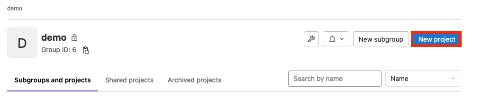
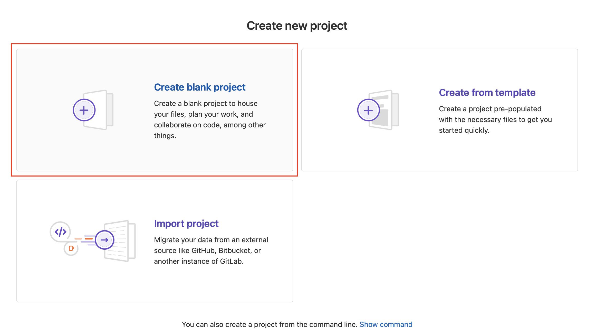
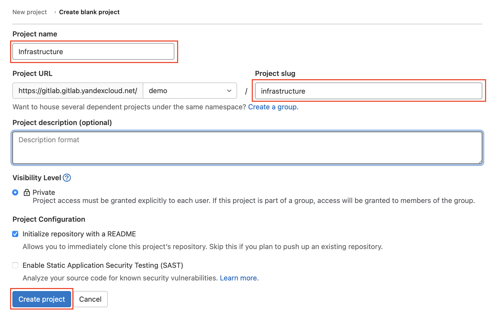
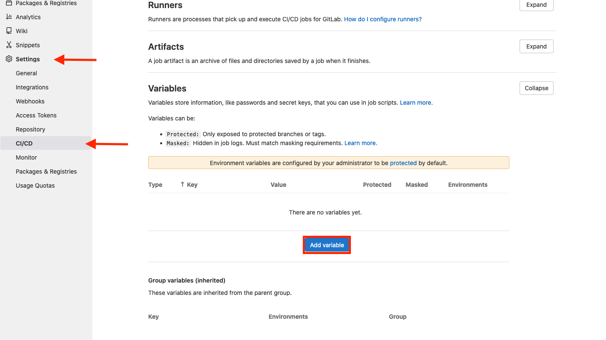
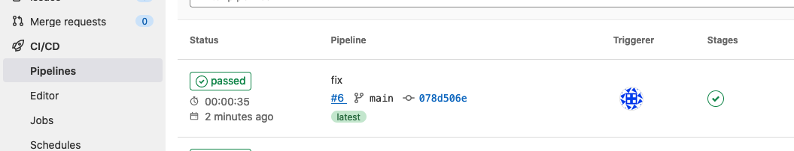
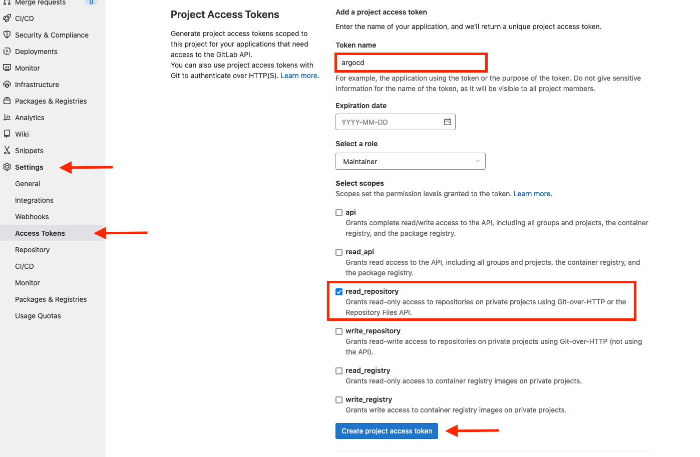
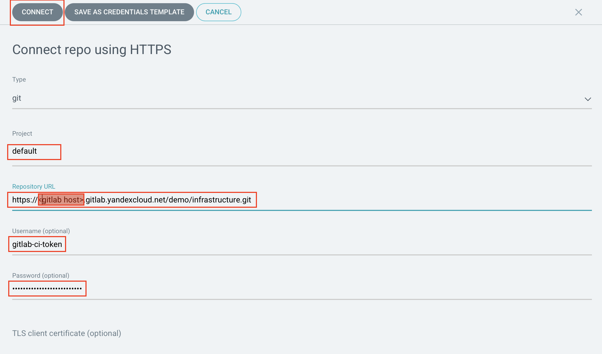

# Argo CD

## Installing Argo CD

Install [argo-cd](https://argoproj.github.io/cd/) using [official guide](https://argo-cd.readthedocs.io/en/stable/getting_started/)


* To get access to the ArgoCD UI, connect to the
   cluster through port-forwarding.

```
kubectl port-forward svc/argo-cd-argocd-server 8443:443
```

Once port-forward is run, the argocd console will be available at `https://127.0.0.1:8443`

> Username to log in to the console: admin

> Take the password to use when logging in the first time from the secret:
> ```
> kubectl get secret argocd-initial-admin-secret \
>  -o jsonpath='{.data.password}' | base64 -d
> ```

## Preparing the application's repository for deployment

* Use the Gitlab instance created in the previous tutorial to create a
   new repository in the `demo` group.





* Get an authorization key for the previously created service account.

```bash
yc iam key create --service-account-name image-pusher -o key.json
```

* Go to the created project's settings and create variables to work
   with Yandex Container Registry.



| Name | Value | Protected | Masked |
|------|-------|-----------|--------|
| CI_REGISTRY | cr.cloudil.com/\<container registry id\> | `no` | `no` |
| CI_REGISTRY_USER | json_key | `no` | `no` |
| CI_REGISTRY_PASSWORD | <`cat key.json \| base64` command output> | `no` | `yes` |

> key.json is the file obtained in the previous step when creating the authorization key.

* Clone the created repository to your local directory.

```bash
git clone git@<gitlab host>:demo/my-app.git
```

* Copy all files from the
   `app/` directory of the current repository to the cloned repository.

> Please note that you also need to copy the
> hidden `.gitlab-ci.yml` file from the above-mentioned directory.

* Commit and push the changes

```bash
git add .
git commit -m "Add app src and CI"
git push
```

* Go to the Gitlab interface and wait for the CI pipeline to complete.



## Deploying your project using Argo CD

### Adding the repository

* Go to the Gitlab web interface, find your project -> Settings -> Access Tokens,
   and create a new token with the `read_repository` rights.



> :warning: **Don't close the page after creating the token**, you'll need it in the next
> step. You can't fetch its value after you close the page!

* Go to the Argo CD web interface -> Settings -> Repositories.

* Select `Connect repo using HTTPS`.

* Paste the URL of our repository from Gitlab in the Repository URL field.

> It ends with `.git`. You can find it by clicking Clone
> on the project page (Clone with HTTPS).

Specify `gitlab-ci-token` in the Username field.

Paste the token from Gitlab in the Password field.

Click `Connect`.



