# Dynamic Environments

## Creating project `app` in GitLab

* Before that you created group `demo` in your GitLab instance. Create new project `app` in this group.

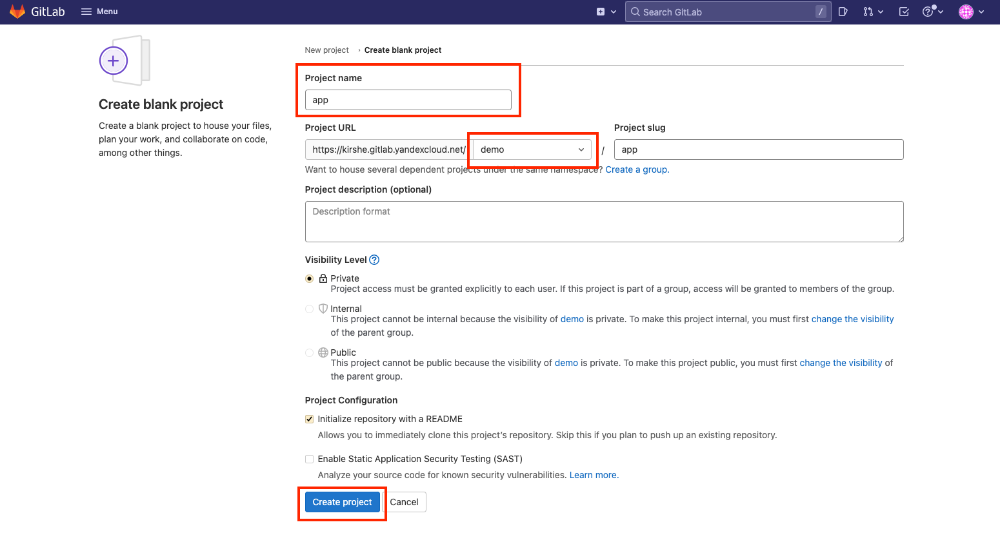

* Create token to connect to GitLab. Open group `demo`, go to `Settings > Access Tokens` and create new access token:

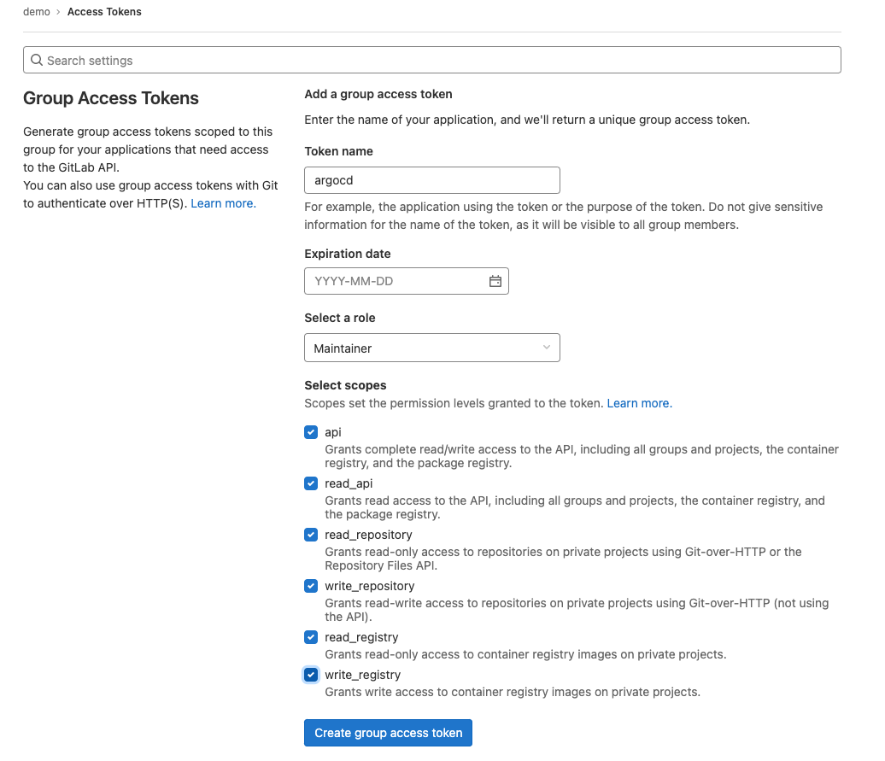


* Copy token to `./gitlab-token.yaml`. Make sure, that you are using the same `namespace` in the manifest, it should be the same as where ArgoCD in installed. After that, you can appy manifest using `kubectl apply -f gitlab-token.yaml`.

* After that, delete pod `argocd-applicationset-controller` for it to recreate.

* Also, you need to configure environmet variables for gitlab-runner. Open group `demo` in Gitlab and go to `Settings > CI/CD > Variables`. Create nesessary variables for connection to the container registry:

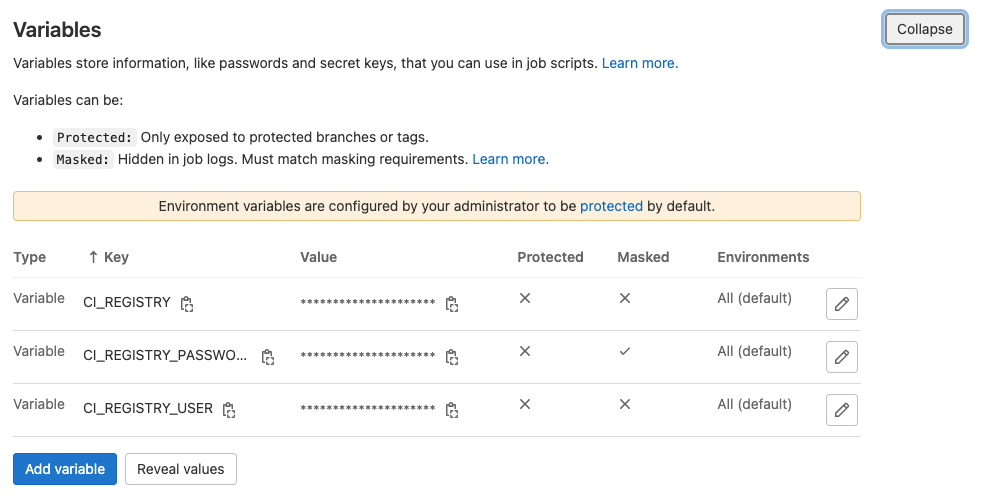


* You used thouse variables already in [part 2](./02-argocd). Make sure, that thouse are applicable for group `demo` and project `app`. If there are no variables -- you need to create thouse.

* Clone the repository and cope into it content of the directory `../projects/app` and push your changes with  `git push`. 

* Make sure, there is `.gitlab-ci.yml` in the repository and build-task is completed succesfully. You should have an image, uploaded into container registry as the result. 
The name of the image you can find in the build-task log -- you will need it later.

* Make sure, that repository `app` is added to ArgoCD. How to add repository is described in [part 2](../02-argocd/).


## Creating project infrastructure in Gitlab

* Create project `infrastructure` in group `demo`, clone it and copy the content of the directory `../projects/infrastructure`. Do not forget to make `git push` afterwards.

* In the file `infrastructure/application-charts/my-app/values.yaml` in `infrastructure` repository you need to configure the name of the image in the repository, GitLab is watching over. You do not need to specify tag. If image was not built, check if build task finished succesfully in the `app` project.

* Make sure, that repository `infrastructure` is added to ArgoCD. How to add repository is described in [part 2](../02-argocd/).


## Creating ApplicationSet

* Edit file `../projects/infrastructure/application-sets/dynamic-envs/dev-envs.yaml`:

1. Paste the URL of Gitlab-instance in two places: in `scmProvider` and in `source`.
2. Make sure namespace you configured is the same namespace where ArgoCD is installed.
2. Make sure to change group name if you named it differently.
3. Make sure to change the gitlab-token secret name. 
4. Make sure, the `destination` is your default cluster where ArgoCD is installed. If you want to use another cluster, make sure to add it to ArgoCD and paste it's name here.
5. Make sure you are using `default` project in ArgoCD.


* The `scmProvider` uses  `^feature` regexp as the filter for brunches and `^app` for repositories. If you created new project with the different name, make sure you edit the filter.

* Create application using ArgoCD UI:

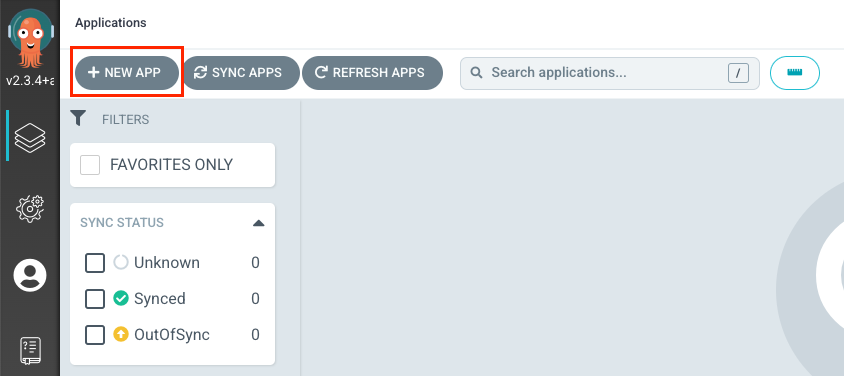

* Fill out application fields and press `Create`:
- Application name: `dynamic-env`
- Project: `default`
- Source Repository URL: `https://xxxxxx.gitlab.yandexcloud.net/demo/infrastructure.git`
- Source Path: `application-sets/dynamic-envs`
- Destination Cluster URL: `https://kubernetes.default.svc`
- Destination Namespace: `argocd`


* You need to define namespace where ArgoCD is installed.


* As the result new application should appear:

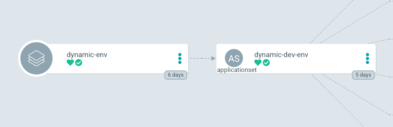


## Testing

* To see how ApplicationSet operates you need to go to project `app` and create new branch. Make sure the branch name starts with  `feature`.

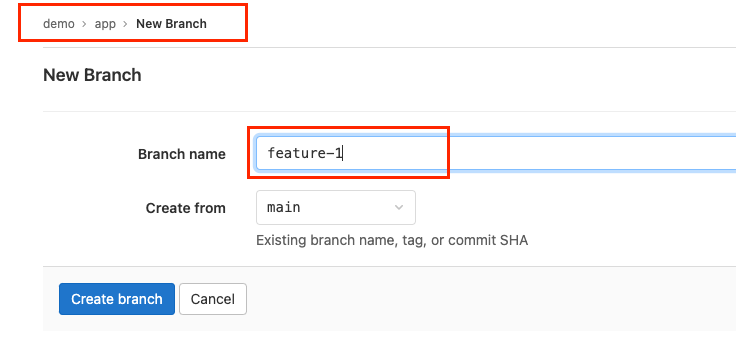

* After the creation of the new branch in `app`, in ArgoCD after several minutes new application shoud appear: 

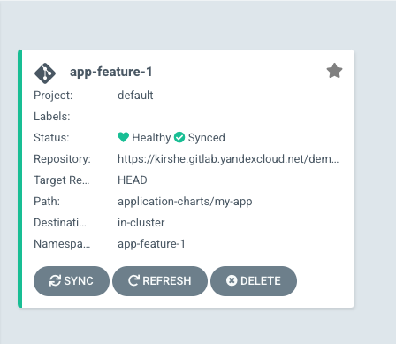

* You can find used version of the image in the `deployment` properties in application.

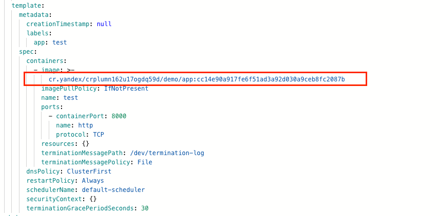

* Same version was built in the build-task of our new branch `app`:

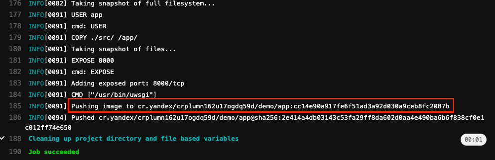


## Clean up

* Open repository `app` in GitLab and delete created branch.

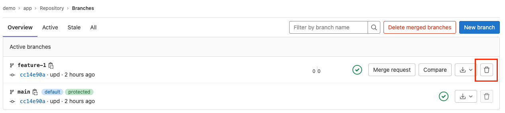

<br/>

* Make sure that the application was deleted from ArgoCD.

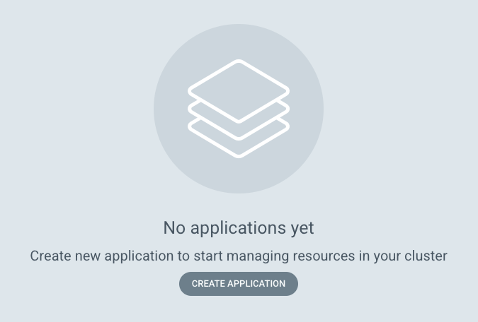


* Delete application:


```bash
kubectl delete application --namespace argocd dynamic-env
```
