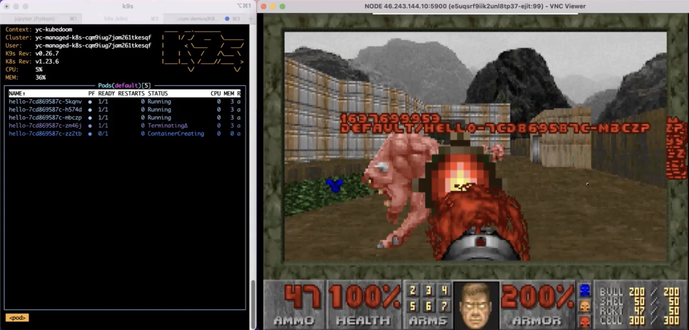

# Terraform script for kubedoom install on Nebius cloud

Terraform script to provision managed K8s cluster on CloudIL infrastructure for KubeDoom demo.
Kill the pods from Doom game UI for chaos engineering :)



## Prepare your cloud account
1. Create service account with admin role for your folder: https://cloudil.co.il/docs/iam/operations/sa/create
2. Assign admin role to service account: https://cloudil.co.il/docs/iam/operations/sa/assign-role-for-sa
3. Create an API key for terraform access: https://cloudil.co.il/docs/iam/operations/api-key/create
4. save the key to `sa_key.json` file for future usage in terraform provider

## Put configuration for terraform
Prepare `../local.tfvars` file in nebius-kubedoom-demo-tf directory
with following content, and fill it with correct parameters of your cloud:
```
my_api_key_file = "../sa_key.json"
my_cloud_id  = "xxxxxxxxxxxxxxxxxxxx"
my_folder_id = "xxxxxxxxxxxxxxxxxxxx"
my_zone      = "il1-x"
```

## Run the terraform to create managed k8s
```
cd demo-mk8s
terraform init
terraform plan -var-file ../local.tfvars
terraform apply -var-file ../local.tfvars
```

Save the output IP addres to connect to VNC later on.

Example output:
```
Apply complete! Resources: 13 added, 0 changed, 0 destroyed.

Outputs:

instance_external_ip = tolist([
  "89.169.96.145",
])
```

## Run the terraform to create doom environment
```
cd demo-kubedoom
terraform init
terraform plan -var-file ../local.tfvars
terraform apply -var-file ../local.tfvars
```

## Connect to the kubedoom
Open VNC client to External Node IP with port `5900`
Password to VNC: `idbehold`

## Cheatcodes for doom :)
1. `IDDQD` -- Invulnerability
2. `IDKFA` -- Full health, ammo, weapons, armor and keys
3. `IDSPISPOPD` -- Walk through walls!
4. `IDBEHOLDI` -- Temporary invisibility

Original kubedoom Git repo [storax/kubedoom](https://github.com/storax/kubedoom)

[def]: kubedoom.jpg